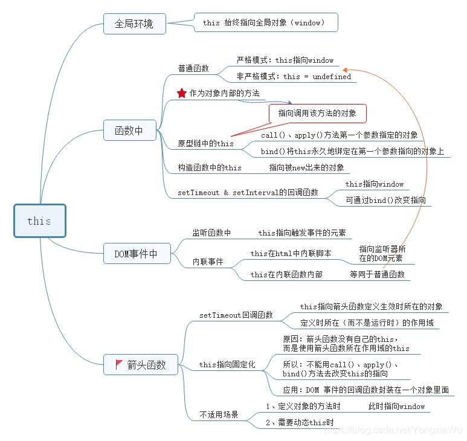

## this指针 call，bind，apply

this指向：

* 普通调用指向window
* 严格模式指向undefined
* obj内部指向obj
* 构造函数中指向实例对象
* 箭头函数this指向寄主对象
* 事件绑定的方法this指向绑定事件的对象
* 定时器函数this指向window
* call,bind,apply改变this指向

```js
function a(a, b, c) {
  console.log(this.name);
  console.log(a, b, c);
}
const b = {
  name: 'default'  
}
a.call(b,1,2,3) //default 1 2 3
a.apply(b, [1, 2, 3]) //default 1 2 3
const c = a.bind(b, 1, 2, 3)
c(); //default 1 2 3
```
**模拟call**
```js
var name = 'window';
var obj = {
    name: 'obj'
};
function fn(a, b, c) {
    console.log(a + b + c + this.name);
};
Function.prototype.newCall = function (obj) {
    obj = obj ? Object(obj) : window;
    obj.fn = this;
    let args = [...arguments].slice(1);
    let result = obj.fn(...args);
    delete obj.fn;
    return result;
}
fn.newCall(obj, "我的", "名字", "是"); // 我的名字是obj
fn.newCall(null, "我的", "名字", "是"); // 我的名字是window
fn.newCall(undefined, "我的", "名字", "是"); // 我的名字是window
```

**模拟apply**

```js
var name = 'window';
var obj = {
    name: 'obj'
};
function fn(a, b, c) {
    console.log(a + b + c + this.name);
};
Function.prototype.newApply = function (obj, arr) {
  obj = obj ? Object(obj) : window;
  obj.fn = this;
  let result;
  if (!arr) {
    result = obj.fn();
  } else {
    result = obj.fn(...arr);
  };
  delete obj.fn
  return result;
}
fn.newApply(obj, ["我的", "名字", "是"]); // 我的名字是obj
fn.newApply(null, ["我的", "名字", "是"]); // 我的名字是window
fn.newApply(undefined, ["我的", "名字", "是"]); // 我的名字是window
```

**模拟bind**
```js
function test(){
    console.log(this.name);
}
let obj = {
    name: 'obj'
};
Function.prototype.newBind = function (obj, ...params) {
    const that = this;
    const bindFn = function(...secondParams){
        const isNew = this instanceof that;
        const context = isNew ? this : Object(obj);
        return that.call(context, ...params, ...secondParams)
    };
    bindFn.prototype = Object.create(that.prototype);
    return bindFn;
}
let f = test.newBind(obj, 2)
f(1);
```


## 垃圾回收机制
>IE的js引擎是用的标记清除来实现的，但是js访问COM对象如BOM,DOM还是基于引用计数的策略的。

引用计数的含义是跟踪记录每个值被引用的次数。当声明了一个变量并将一个引用类型赋值给该变量时，则这个值的引用次数就是1。相反，如果包含对这个值引用的变量又取得了另外一个值，则这个值的引用次数就减1。当这个引用次数变成0时，则说明没有办法再访问这个值了，因而就可以将其所占的内存空间给收回来。

**标记-清除垃圾回收算法(V8)**
V8中，将内存分为新生代和老生代，新生代的对象为存活时间较短的对象，老生代的对象为存活时间较长或常驻内存的对象。
新生代内存被划分为两个空间，from和to空间，新建对象都会存储在中，进行垃圾回收是，活动状态的对象会被复制到to空间中，from空间被清空，完成复制后from和to空间的关系发生转换。
> * 当一个对象经过多次复制依然存活时，被认为时生命周期较长的对象，被移动到老生代，使用新算法进行管理。
> * 如果复制一个对象到To空间，To空间占用超过25%，则该对象被直接晋升到老生代空间中

https://blog.csdn.net/zhouziyu2011/article/details/61201613
https://blog.csdn.net/annwyna/article/details/107733877
https://www.cnblogs.com/suihang/p/12806830.html
https://www.jianshu.com/p/5db5f1176870


```js
// scheduler 异步调度器 同时运行任务最多maxNum次
class Scheduler {
  constructor(maxNum) {
    this.taskList = [];
    this.count = 0;
    this.maxNum = maxNum;
  }
  async add(promiseCreator) {
    if (this.count >= this.maxNum) {
      await new Promise((resolve) => {
        this.taskList.push(resolve)
      })
    }
    this.count ++;
    const result = await promiseCreator();
    this.count --;
    if (this.taskList.length > 0) {
      this.taskList.shift()();
    }
    return result;
  }
}

const timeout = (time) => new Promise(resolve => {
  setTimeout(resolve, time)
})
const scheduler = new Scheduler(2);
const addTask = (time, val) => {
  scheduler.add(() => {
    return timeout(time).then(() => {
      console.log(val)
    })
  })
}
addTask(1000, '1');
addTask(500, '2');
addTask(300, '3');
addTask(400, '4');
```

