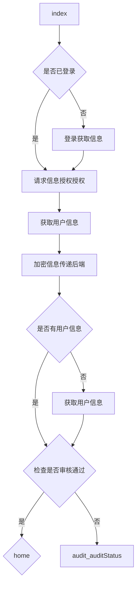

A --> B     A带箭头指向B

A --- B      A不带箭头指向B

A -.- B      A用虚线指向B

A -.-> B    A用带箭头的虚线指向B

A ==> B   A用加粗的箭头指向B

A -- 描述 --- B       A不带箭头指向B并在中间加上文字描述

A -- 描述 --> B      A带箭头指向B并在中间加上文字描述

A -. 描述 .-> B      A用带箭头的虚线指向B并在中间加上文字描述

A == 描述 ==> B  A用加粗的箭头指向B并在中间加上文字描述

获取用户信息 

 

