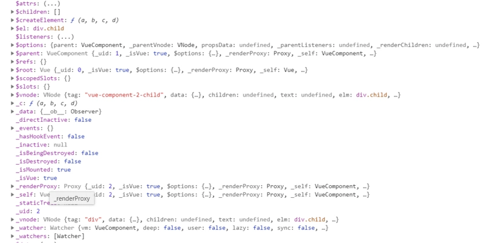
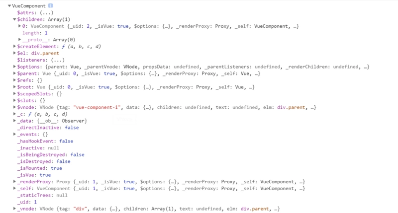
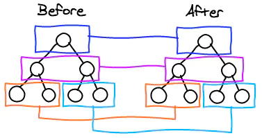

virtual DOM 
vue -> Vnode Tree
#### VNode
```js
class Vnode {
    constructor(tag, data, children, text, elm, context, componentOptions) {
        // ...
    }
}
```
|key|value|
|---|---|
|tag|节点标签名|
|data|节点数据|
|children|子节点|
|text|节点文本|
|elm|对应真实DOM节点|
|ns|命名空间|
|context|编译作用域|
|functionalContext|函数话组件作用域|
|key|节点标志|
|componentOptions|组件的option选项|
|componentInstance|当前节点对应组件实例|
|parent|当前节点父节点|
|raw|是否是原生html|
|isStatic|是否是静态节点|
|isRootInsert|是否作为根节点插入|
|isComment|是否为注释节点|
|isOnce|是否有v-once指令|

### 生成VNode
1. **创建非组件节点的VNode**
  * tag不存在，创建空节点、注释、文本界定啊
  * 使用vue内部列出的元素类型的VNode
  * 没有列出的创建元素类型的VNode
  > \<p>123\</p>
  > * tag为p，没有text值的节点
  > * 没有tag类型，text值为123的节点

2. **创建组件节点的VNode**
组件节点生成的vnode,不会和DOM Tree的节点一一对应。只存在VNode Tree中
eg:
```html
<!--parent.vue--->
<div class="parent">
  <child></child>
</div>
<!--child.vue--->
<template>
  <div class="child"></div>
</template>
<!--DOM 结构--->
<div class="parent">
  <div class="child"></div>
</div>
```
真正渲染的DOM没有child标签，child..vue是一个子组件，在vue中会给这个组件创建一个占位的VNode，只会出现在VNode Tree中。
child实例对象

parent实例对象


1. 父VNode通过children指向子VNode
1. 子VNode通过$parent指向父VNode
1. 占位VNode为实例的$VNode
1. 渲染的VNode为对象的_VNode

<!-- #### patch
在创建vue实例时，会执行以下代码：
```js
updateComponent = () => {
    const vnode = vm._render();
    vm._update(vnode)
}
vm._watcher = new Watcher(vm, updateComponent, noop)
```
在data中定义了个变量a,在模板中使用，代码中生成的watcher就会加入到a的订阅者列表中，当a改变时，对应的订阅者收到变动信息，就会触发watcher的update方法，实际update最后调用的就是这里生命的updateComponent。updateComponent是对patch过程的封装，patch的本质是将新旧vnode进行比较，创建，删除或者更新DOM节点/组件实例。
* 如果没有老节点，首次patch，创建一i个新的节点
* 老节点存在
    * 老节点不是真实DOM并和新节点相似
        * 调用patchVnode修改现有节点
    * 新老节点不相同
        * 如果老节点是真实DDOM，创建相应的VNode节点
        * 为新的vnode创建原始/组件实例，若parentElm存在，则插入到父元素上
        * 如果组件根节点替换，遍历更新父节点element，然后移除父节点
* 调用insert钩子
    * 首次patch且vnode.parent存在，设置vnode.parent.data.pendingInsert = queue
    * 如果不满足上面条件则对每个vnode调用insert钩子
* 返回vnode.elm真实DOm内容 -->


patch(src/core/vdom/patch.js)所用的diff算法来源于snabbdom，只会在同层级进行比较，不会跨层级比较。图示如下：
